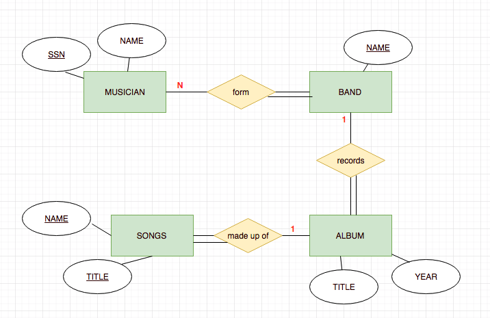
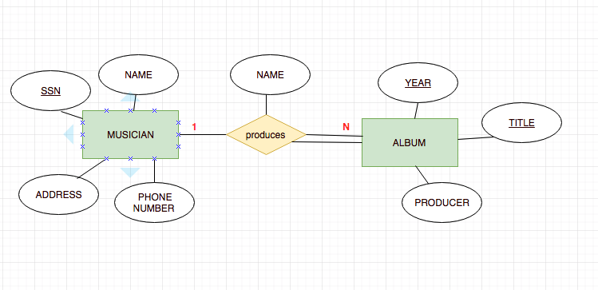

<center>
<strong>
#Homework 3
###Joseph Mulray
###INFO210
####March 2, 2017
</center>

</strong>
<br/>
<br/>


###Part1:
a.
<center>


<br/>
<br/>
</center>
b.
<center>


<br/>
<br/>

</center>
###Part 2:
a.
 
```SQL
create table Forrest(
	name varchar(128) primary key
);

create table Tree_Made_of(
	id number primary key
	name varchar(128),
	foreign key (name) references Forrest(name)	
);
```
All the key constraints are captured using this method of relaitional implimentation, creating a table TRee_made_of consists of tree attributes that also identify its type of forrest found in. Allows for the one to many relationship.

<br/>
<br/>

b.

```SQL
create table Mother(
 ssn char(12) primary key,
 name varchar(128),
 dob date
);

create table Child(
	ssn char(12) primary key,
	name varchar(128),
	dob date,
	mother_name varchar(128),
	foreign key (mother_name) references Mother(name)
);
```
The approach for this relationship allows for 1 to many relationship of a mother to a mother of child, creation of two tables highlights a clearer approach rather than a person table that has both characteristics of a mother and a child in one recursive relation. 
<br/>
<br/>
c.

```SQL
create table Monarch(
	name varchar(128) primary key,
);

create table Country(
	name varchar(128) primary key,
);

create table Rules(
	monarch_name varchar(128) primary key,
	country_name varchar(128),
	foreign key (monarch_name) references Monarch(name),
	foreign key (country_name) references Country(name)
);
```
The constraints captured in this relational implimentation allow for the at least one monarch ruling one country. This approach allows for monarch to be added along with countries without modifying existing data in Rules. 
