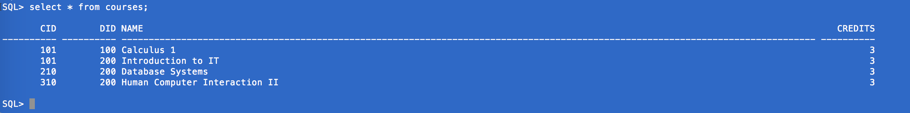
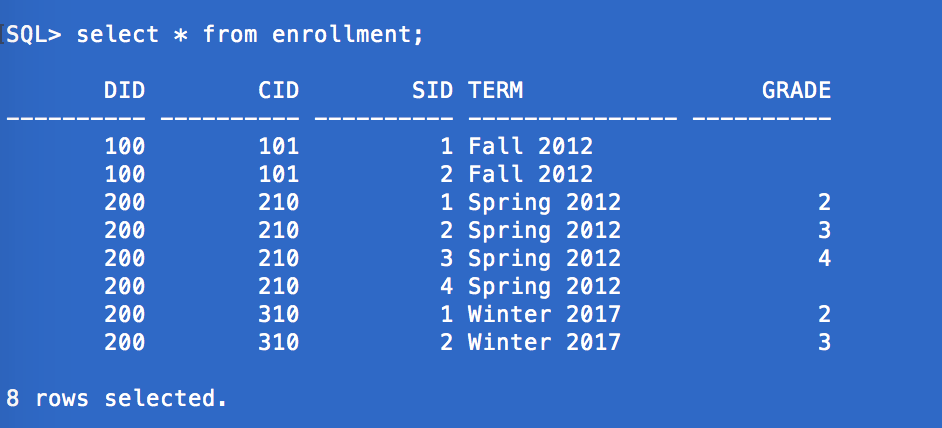

<center>
#HOMEWORK 2


Joseph Mulray<br/>
INFO 210 <br/>
Professor Song<br/>
Febuary 7 2017<br/>
</center>

<strong>
<br/>
<br/>

###Problem 1:

(a) List the names of all European cities with population of more than 600,000.


$$ \pi_{City.city\_name}(\sigma_{City.population > 600,000 \ \cap\  Country.continent="Europe"} \ (Country\Join City))$$

<br/>
(b) List the names of all countries for which no cities have been entered into the City table.

$$    \pi_{country\_name}((\sigma_{country\_name}\  Country)\ /\ (\sigma_{country\_name} \ City))$$

<br/>
(c) List names and continents of countries that are either in Europe or whose capitals have
a population of over 1 million.


$$\pi_{\ City.city\_name,\ Country.continent}( \sigma_{Country.country\_name="Europe \ \cup\ City.is\_capital="yes"\ \cap \ City.population\ > 1,000,000} (Country\Join City)) $$

<br/>

(d) List all pairs of cities such that one of them is a capital of some country, and the other is
a non-capital city in that same country. For each city in the pair, list its name.

 
$$\pi_{iscap.city\_name,\ nocap.city\_name}(\ (\rho_{iscap}(\sigma_{is\_capital="yes"}\ City))  \Join_{iscap.country=nocap.country}  (\ \rho_{nocap}(\sigma_{is\_capital="no"}\ City ))\ ) $$


<br/>
###Problem 2:

a.

```sql
insert into Courses (cid, did, name) values (310, 200, 'Human Computer Interaction II');
insert into Enrollment(cid, did, sid, term, grade) values (310, 200, 1, 'Winter 2017', 2);
insert into Enrollment(cid, did, sid, term, grade) values (310, 200, 2, 'Winter 2017', 3);
```

<br/>
b.

```sql
select * from Courses;
select * from Enrollment;
```
<br/>

<center>

Courses 
<br/>
<br/>



Enrollment
</center>

