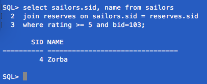
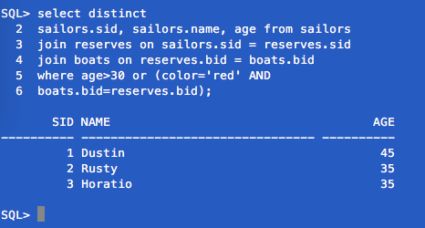
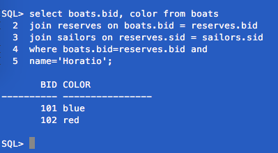
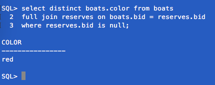
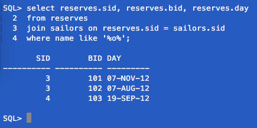
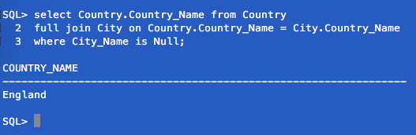
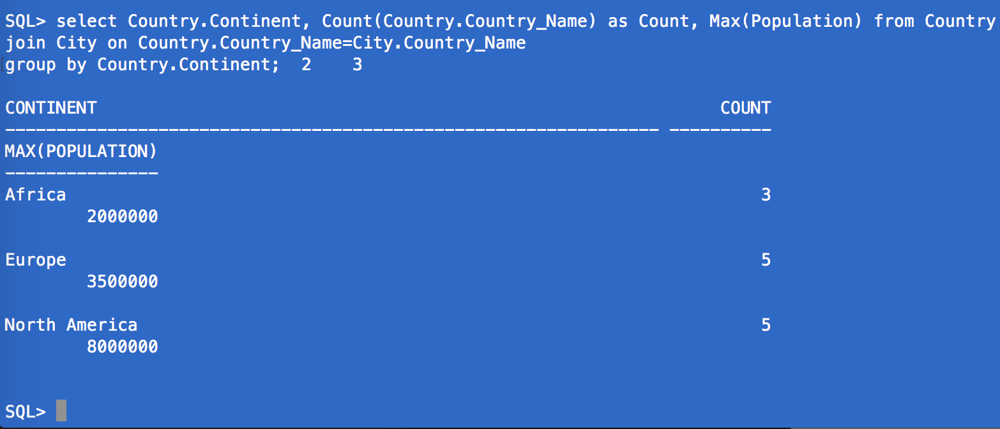
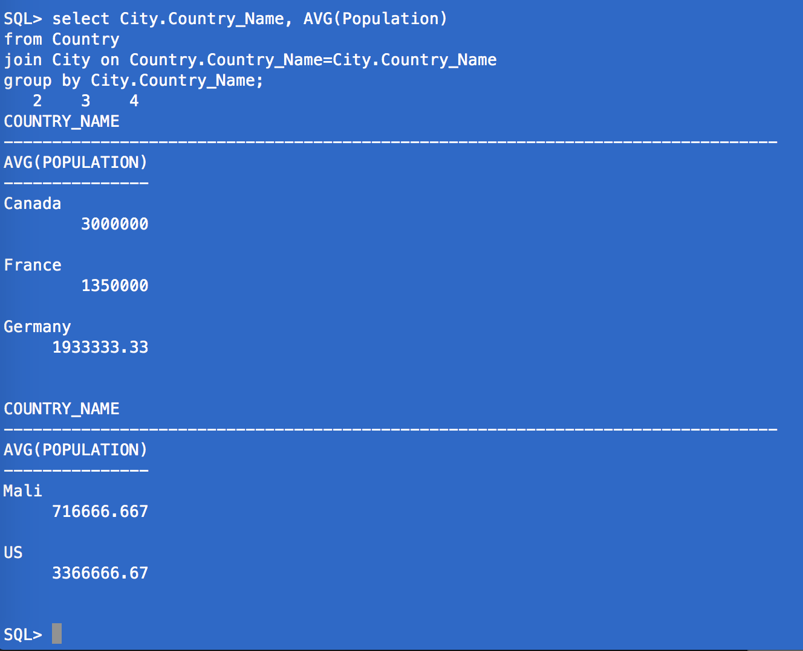

<center>
<strong>
#Homework 4
###Joseph Mulray
####INFO 210
####March 6, 2017
</center>

</strong>
<br/>
<br/>


###Part 1:

a.

```sql
select sailors.sid, name from sailors
join reserves on sailors.sid = reserves.sid
where rating >= 5 and bid=103;

```

<br/>
<br/>

b.

```sql
select distinct sailors.sid, sailors.name, age from sailors
join reserves on sailors.sid = reserves.sid
join boats on reserves.bid = boats.bid
where age>30 or (color='red' AND boats.bid=reserves.bid);
```


<br/>
<br/>

c.

```sql
select boats.bid, color from boats
join reserves on boats.bid = reserves.bid
join sailors on reserves.sid = sailors.sid
where boats.bid=reserves.bid and name='Horatio';
```


<br/>
<br/>

d.

```sql
select distinct boats.color from boats
full join reserves on boats.bid = reserves.bid
where reserves.bid is null;
```



<br/>
<br/>

e.

```sql
select reserves.sid, reserves.bid, reserves.day
from reserves
join sailors on reserves.sid = sailors.sid
where name like '%o%';
```


<br/>
<br/>

###Part 2:

<br/>
<br/>

```sql
drop table if exists City;
drop table if exists Country;


create table Country(
Country_Name varchar(64) primary key,
Continent varchar(64) not null
);

create table City(
City_Name varchar(128),
Country_Name varchar(128),
isCapital char(3) not null,
Population number not null,
primary key(City_Name, Country_Name),
foreign key (Country_Name) references Country(Country_Name)
);

insert into Country (Country_Name, Continent) values ('US', 'North America');
insert into Country (Country_Name, Continent) values ('Canada', 'North America');
insert into Country (Country_Name, Continent) values ('England', 'Europe');
insert into Country (Country_Name, Continent) values ('Germany', 'Europe');
insert into Country (Country_Name, Continent) values ('France', 'Europe');
insert into Country (Country_Name, Continent) values ('Mali', 'Africa');


insert into City (City_Name, Country_Name, isCapital, Population) values ('New York, NY', 'US', 'no', 8000000);
insert into City (City_Name, Country_Name, isCapital, Population) values ('Washington, DC', 'US', 'yes', 600000);
insert into City (City_Name, Country_Name, isCapital, Population) values ('Philadelphia, PA', 'US', 'no', 1500000);
insert into City (City_Name, Country_Name, isCapital, Population) values ('Ottawa', 'Canada', 'yes', 3500000);	
insert into City (City_Name, Country_Name, isCapital, Population) values ('Toronto', 'Canada', 'no', 2500000);
insert into City (City_Name, Country_Name, isCapital, Population) values ('Berlin', 'Germany', 'yes', 3500000);
insert into City (City_Name, Country_Name, isCapital, Population) values ('Hamburg', 'Germany', 'no', 2000000);
insert into City (City_Name, Country_Name, isCapital, Population) values ('Bonn', 'Germany', 'no', 300000);
insert into City (City_Name, Country_Name, isCapital, Population) values ('Paris', 'France', 'yes', 2000000);
insert into City (City_Name, Country_Name, isCapital, Population) values ('Lyon', 'France', 'no', 700000);
insert into City (City_Name, Country_Name, isCapital, Population) values ('Bamako', 'Mali', 'yes', 2000000);
insert into City (City_Name, Country_Name, isCapital, Population) values ('Timbuktu', 'Mali', 'no', 50000);
insert into City (City_Name, Country_Name, isCapital, Population) values ('Mopti', 'Mali', 'yes', 100000);

```
<br/>
<br/>

a.

```sql
select Country.Country_Name from Country
full join City on Country.Country_Name = City.Country_Name
where City_Name is Null;
```

<br/>
<br/>

b.

 
```sql
select Country.Continent, Count(Country.Country_Name) as Count, Max(Population) from Country
join City on Country.Country_Name=City.Country_Name
group by Country.Continent;
```


<br/>
<br/>

c.

```sql
select City.Country_Name, AVG(Population)
from Country
join City on Country.Country_Name=City.Country_Name
group by City.Country_Name;
 
```


<br/>
<br/>
